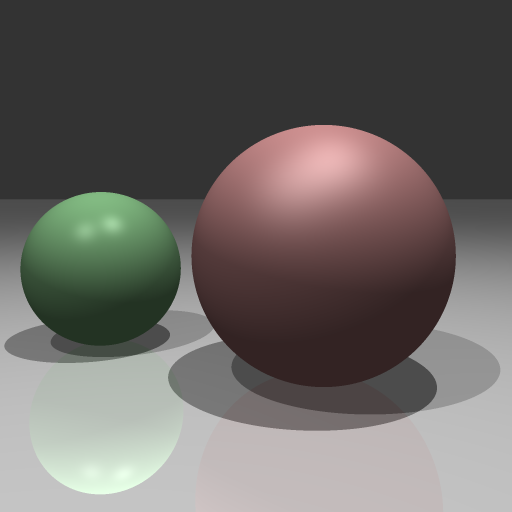
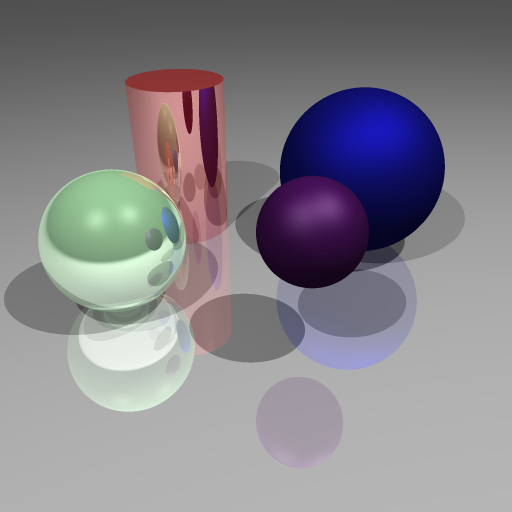
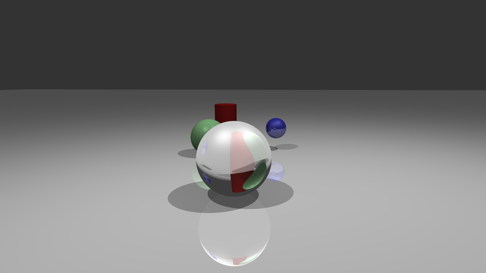

# Assignment 1: Raytrace

Simple raytracer implementation in C++ in the context of the first homework of the fundamentals of computer graphics course held by Prof. Fabio Pellacini.

### Introduction

In your first assignment, you will create a simple ray tracer. Ray tracing is a very powerful algorithm capable of creating complex and realistic images. While you will not be able to generate realistic images in your first assignment, your code will create a lot of interesting effects.

### Requirements

You are to implement the code left blank in `intersection.cpp` and `raytrace.cpp` to implement the following features.

1. Basic Raytracing (`raytrace`). Implement a basic raytrace algorithm that will sample the image plane and generate a picture. Within the raytrace loop, implement camera ray generation given an image plane position specified in normalized coordinates, i.e., in [0,1]x[0,1], and the local frame of the camera.
2. Ray-Scene intersection code (`intersect_surfaces`). Intersect the ray with all surfaces in the scenes, and find the first intersection. For each surface implement either ray-quad or ray-sphere intersection. Return the result in an intersection record (`intersection3f`) that includes whether there was a hit, the ray parameter, the hit positiona and normal and the surface material.
3. Compute the ray color (`raytrace_ray`). Compute the ray color by checking for intersection (and if not returning the background), add color for each light by computing the light intensity, the Phong-Blinn material, and adding shadows (testing with `intersect_surfaces`) and adding relfections if needed (recursing on `rauytrace_ray`).
4. Antialiasing (`raytrace`). Implement an antialias raytracer by sampling multiple times the image for each pixel. Follow the psuedocode given in class for this. Turn on antialiasing with `image_samples > 1`.

### Extra Credit

1. Add a capped-cylinder primitive, composed of a cylinder lateral surface and two disk caps. Demonstrate your code with a scene containing a Phong cylinder.

   

2. Add refraction to your code by augmenting the `raytrace_ray` function (similar to reflective code above). You can find the details on how to generate refraction rays in Shirley's book or ask the staff. The reflection code is a good start for this. Demonstrate your code with a new scene, which should contain a glass sphere.

